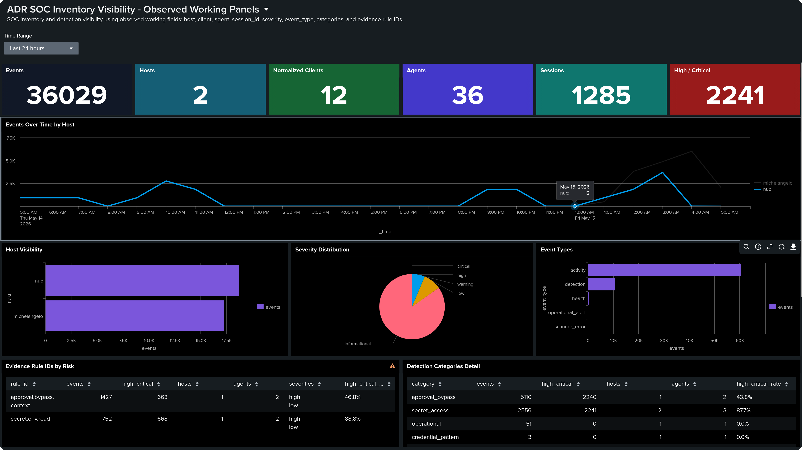

# Telltale

<p align="center">
  
</p>

Telltale is an open-source detection layer for AI coding agents, built as the foundation for Agent Detection and Response (ADR). It detects telltale signs of risky behavior, preserves redacted evidence, and exports telemetry for review, alerting, and future response workflows.

> Compatibility note: Telltale currently keeps the existing Rust crate
> name, binary name, environment variable prefixes, and a few schema fields
> under `adr` for build and data-format compatibility. The project name is
> Telltale.

## Why Telltale exists

Agentic coding is not just “the user typed a prompt and the model answered.” By the time an agent decides to run a command, its input tokens may include:

- user prompts and chat history;
- system, developer, and assistant instructions;
- tool schemas, MCP descriptions, and tool results;
- skills, subagents, plugins, and IDE extension context;
- RAG snippets, documentation, search results, and web pages;
- repository files, diagnostics, terminal output, and build logs;
- router or aggregator metadata from services such as model gateways and coding assistants;
- prior session state, retries, summaries, and the assorted incantations and ceremonies required to keep a long-running agent workflow on the rails.

Some of that is intentional. Some of it is scaffolding. Some of it is simply the reality of how modern agentic systems are built.

That creates a real visibility problem for defenders. SOCs and security teams often do not have a good handle on what agentic coders actually did. A compromised router, poisoned skill, prompt-injected web page, malicious tool response, risky extension, or unexpected model behavior can turn into file reads, shell commands, network calls, credential access, or entire sessions that drift away from user intent. When that happens, the evidence is often scattered across local transcripts, tool logs, and application-specific session stores.

Organizations may define policies for what agents should never do, but those policies are not easy to monitor consistently across many platforms, session formats, and tool surfaces. It is difficult to write detections that scale cleanly from obvious policy violations to broader risky behavior and undesired sessions. Telltale takes a risk-analysis approach: scan local session stores, normalize messages and tool activity, apply detections, score behavior across a session, redact sensitive evidence, and emit structured JSONL telemetry that a SOC can inspect, search, forward, and alert on.

Set it up around your agent session stores and point the output at your alerting pipeline. Telltale is detection-first today: it gives builders and SOCs concrete, redacted telemetry to inspect during or after long-running agent tasks, and it exports that telemetry for downstream response workflows.

## What it does

- Discovers supported agent session stores on disk.
- Parses heterogeneous transcript formats into a shared event model.
- Detects suspicious tool activity with YAML-defined rules.
- Scores related behavior across a session window.
- Redacts sensitive evidence before writing events.
- Supports synthetic fixture-based testing across multiple client formats.

## Source support status

Current source support should be read conservatively.

- **Most validated so far**: Codex and OpenCode
- **Some real-world validation**: Claude Code, GitHub Copilot, Gemini CLI
- **Primarily fixture-backed today**: Qwen CLI, RooCode, KiloCode, OpenClaw

Telltale can parse multiple source shapes, but real-world validation depth is not yet uniform across every client.

| Source | Client ID | Session format | Current confidence |
| --- | --- | --- | --- |
| Codex | `codex` | JSONL sessions, archived sessions, headless JSONL | highest |
| OpenCode | `opencode` | SQLite and legacy JSON | highest |
| Claude Code | `claude` | JSONL | medium |
| GitHub Copilot | `copilot` | process logs | medium |
| Gemini CLI | `gemini` | JSON | medium-low |
| Qwen CLI | `qwen` | JSONL | fixture-backed |
| RooCode | `roocode` | `ui_messages.json` | fixture-backed |
| KiloCode | `kilocode` | `ui_messages.json` | fixture-backed |
| OpenClaw | `openclaw` | JSONL-like files | fixture-backed |

## Quick start

```sh
cargo run -- scan --once --dry-run --root tests/fixtures/session_stores
cargo run -- rules validate --rules config/rules/tool-call-regex.yaml
cargo test
```

The fixture tree in `tests/fixtures/` is synthetic and safe for local verification.

- Install and setup guide: [docs/install.md](docs/install.md)

## Telemetry Output

Telltale is designed to produce structured telemetry that can be searched, charted, and alerted on in a SIEM.
Write append-only JSONL locally, then connect the output to your preferred
shipper or log pipeline after reviewing your environment's data-handling
requirements.

<p align="center">
  
</p>

Example Splunk dashboard built from Telltale telemetry, showing the kinds of
inventory, severity, evidence, and trend views defenders can build.

Common use cases include:

- tracking agent activity volume across hosts, clients, and sessions;
- highlighting high and critical detections for analyst review;
- breaking down detection categories and evidence rule IDs for triage;
- spotting spikes, outliers, and session drift over time;
- feeding dashboards, alerts, and investigations in Splunk or another SIEM.

## Early development and community

Telltale is still in early development. The project is usable, but source coverage, detections, and operational ergonomics are still evolving.

PRs, issues, feedback, and active engagement are very welcome. We would especially love testers who can help identify missing features, blind spots, or parsing gaps across different coding-agent platforms and handlers.

## Project layout

- `src/` — scanner, parser, detection, scoring, and event emission code
- `tests/` — CLI coverage plus synthetic fixtures
- `schemas/` — JSON schema for emitted events
- `config/rules/tool-call-regex.yaml` — bundled detection rules
- `config/allowlists.yaml` — suppression examples
- `docs/` — public technical documentation

## Documentation

- [Install](docs/install.md)
- [Architecture](docs/architecture.md)
- [Detection model](docs/detection-model.md)
- [Detection content standard](docs/detection-content-standard.md)
- [Agent policy authoring](docs/agent-policy-authoring.md)
- [Privacy model](docs/privacy-model.md)
- [Requirements](docs/requirements.md)
- [Session sources](docs/session-sources.md)
- [Source validation matrix](docs/source-validation-matrix.md)
- [Agent capability profiles](docs/agent-capability-profiles.md)
- [Client capability matrix](docs/client-capability-matrix.md)
- [Threat taxonomy](docs/threat-taxonomy.md)
- [MITRE ATLAS coverage](MITRE_ATLAS_COVERAGE.md)
- [Use cases](docs/use-cases.md)
- [Normalization schema](docs/normalization-schema.md)
- [Policy modes](docs/policy-modes.md)
- [Trust boundaries](docs/trust-boundaries.md)
- [License and packaging](docs/license-and-packaging.md)

## License

Telltale Core is licensed under Apache-2.0. See [LICENSE](LICENSE) and
[License and packaging](docs/license-and-packaging.md) for the open-source core
boundary and future separate-license feature boundary.
